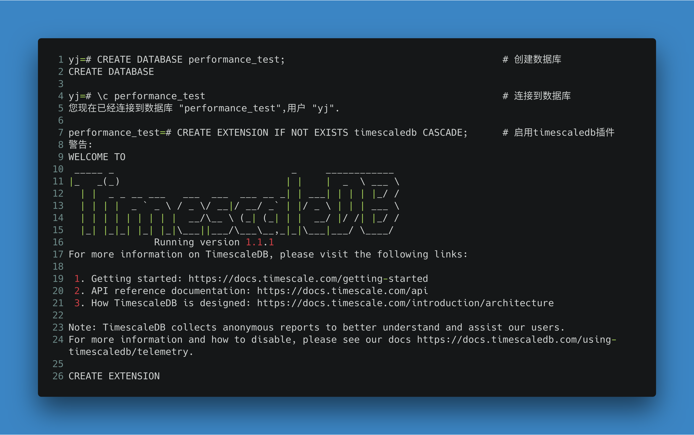
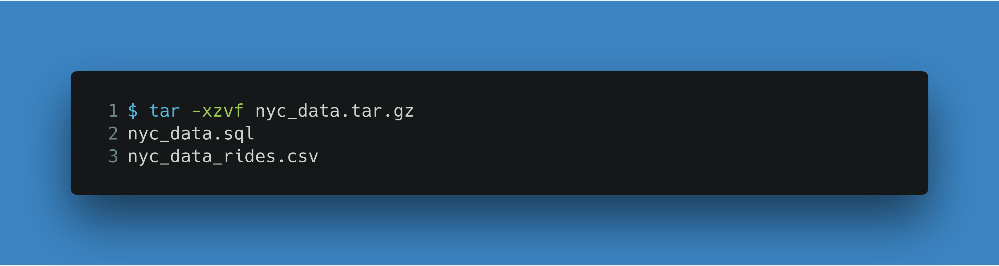
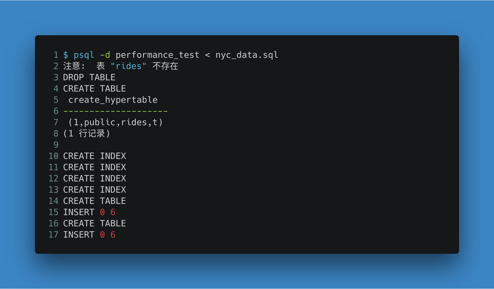
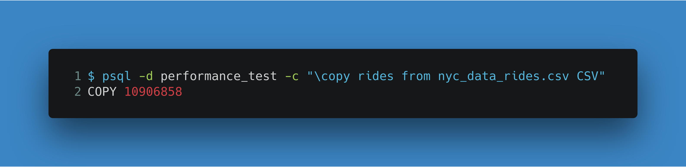
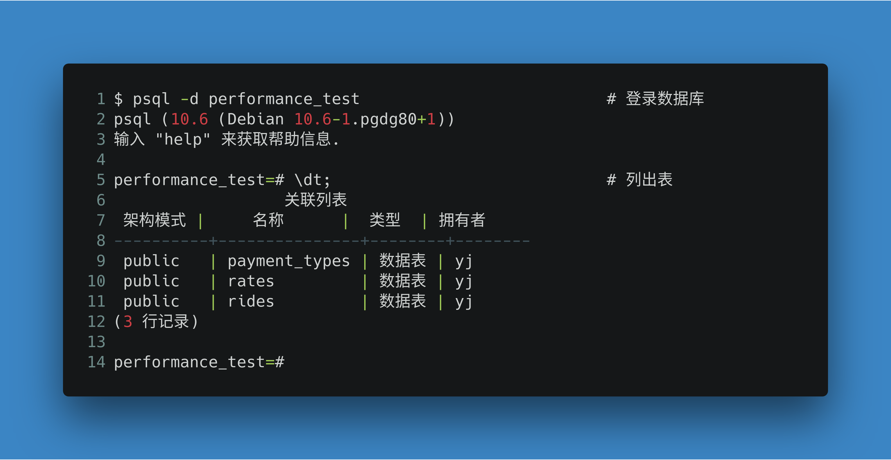

# TimescaleDB安装测试

---

[Github](An open-source time-series database optimized for fast ingest and complex queries. Engineered up from PostgreSQL, packaged as an extension)

[TimescaleDB](https://www.timescale.com)：An open-source time-series database optimized for fast ingest and complex queries. Engineered up from PostgreSQL, packaged as an extension

---

---

**[参考]**:

[docs.timescale](https://docs.timescale.com)

---

## 性能测试

1. 下载测试数据

   [测试数据集下载(400+MB)](http://link.zhihu.com/?target=https%3A//timescaledata.blob.core.windows.net/datasets/nyc_data.tar.gz)

2. 创建测试数据库

   

3. 载入数据

   - 解压测试数据

     

   - 导入表结构

     

   - 导入数据

     

   - 查看

     

4. 查询

   

